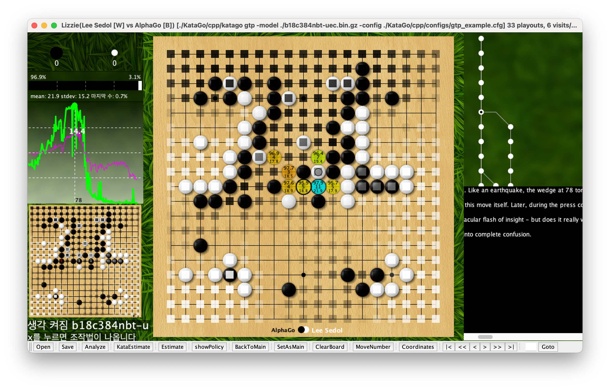

# Play a game

## Open Sources

### AI

- KataGo: [github](https://github.com/lightvector/KataGo): GTP engine and self-play learning in Go
- Leela Zero: [github](https://github.com/leela-zero/leela-zero): Go engine with no human-provided knowledge, modeled after the AlphaGo Zero paper.

### GUI

- Lizzie: [github](https://github.com/featurecat/lizzie), [releases](https://github.com/featurecat/lizzie/releases)
- yzyray/lizzieyzy: [github](https://github.com/yzyray/lizzieyzy), [english](https://github.com/yzyray/lizzieyzy/blob/main/README_EN.md), [manual.pdf](https://github.com/yzyray/lizzieyzy/blob/main/readme_en.pdf), [releases](https://github.com/yzyray/lizzieyzy/releases)

---

## Setup

### Java

- JDK 17: [Install](https://github.com/rurumimic/supply/blob/master/languages/java.md)

### Download or Build KataGo

- KataGo: [releases](https://github.com/lightvector/KataGo/releases)
  - katago
  - neural net model file: `.bin.gz`

```bash
brew install katago
```

```bash
sudo port install cmake
# or
brew install cmake

git clone https://github.com/lightvector/KataGo.git
cd KataGo

cd cpp
cmake . -DUSE_BACKEND=OPENCL
make
```

### Download or Build Leela Zero

- Leela Zero: [releases](https://github.com/leela-zero/leela-zero/releases)

```bash
brew install leela-zero
```

#### Build Leela Zero on macOS

```bash
sudo port install boost cmake zlib
# or
brew install boost cmake zlib

git clone https://github.com/leela-zero/leela-zero
cd leela-zero
git submodule update --init --recursive

mkdir build && cd build

cmake ..
cmake --build .
```

### Download Lizzie

- Lizzie: [releases](https://github.com/featurecat/lizzie/releases)

---

## Run Lizzie

```bash
java -jar lizzie.jar
```

### Engines

- Settings → Engines

```bash
./KataGo/cpp/katago gtp -model ./b18c384nbt-uec.bin.gz -config ./KataGo/cpp/configs/gtp_example.cfg
./leela-zero/build/leelaz --gtp --lagbuffer 0 --weights lznetwork.gz
```

---

## Lee Sedol vs Alphago

### Game 4

- Game 4: [20160313-LeeSedol-Alphago.sgf](/games/20160313-LeeSedol-Alphago.sgf)


#### KataGo


